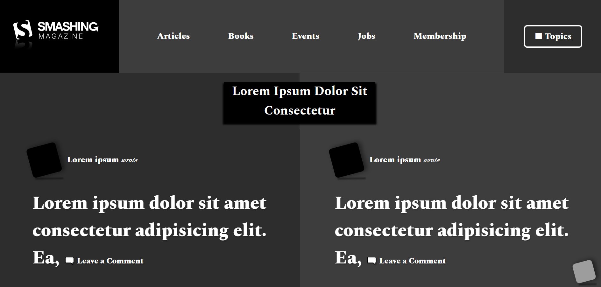

# Project Name

[Smashing Magazine UX Heatmap](https://www.smashingmagazine.com/)

HTML & CSS Heatmap

## Built With

- HTML,
- CSS

## Live Demo

[Live Demo Link](https://rawcdn.githack.com/hatemswaileh/heatmap-ux-Taiwo-Hatem/c7510de166e24c9a00dba08338d0f82372104359/index.html)

## Getting Started

To get a local copy up and running follow these simple example steps.

### Pre-Requisites

localhost or a web hosting

### Setup

Just download the files & upload it to your folder

### Usage

Smashing Magazine UX Heatmap (Layout)

## Authors

### Solo Project
👤 **Hatem Sweileh**

- Github: [@hatemswaileh](https://github.com/hatemswaileh/)
- Twitter: [@hatemswaileh](https://twitter.com/hatemswaileh)
- Linkedin: [linkedin](https://www.linkedin.com/in/HatemSwaileh)

👤 **Taiwo Coker**

- Github: [@taiwocoker](https://github.com/taiwocoker)
- Twitter: [@SelloCoker](https://twitter.com/SelloCoker)
- Linkedin: [linkedin](https://www.linkedin.com/in/taiwo-coker-06b46261/)

## 🤝 Contributing

Contributions, issues and feature requests are welcome!

Feel free to check the [issues page](issues/).

## Show your support

Give a ⭐️ if you like this project!

## 📝 Acknowledgments

- If you are applying issues, Please just use HTML & CSS
- Please keep in mind that this project is not fully functional, it's just a HeatMap for Smashing Magazine
